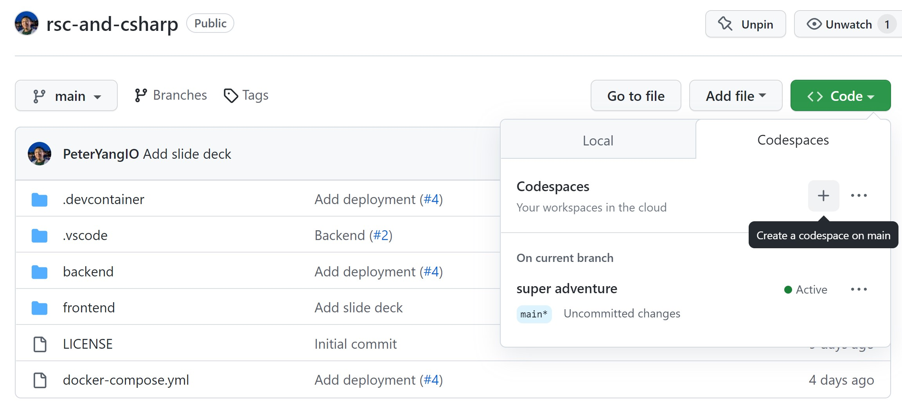

# React Server Components + C#
This project shows a more end-to-end implementation of how React Server Components (RSC) would look in a full-stack application. Some highlights are:
- Integration with a non-JS backend + generating strongly typed API clients using Swagger and TypeScript
- Securely handling JWT authentication
- Easy setup of development and deployment environments with docker

Jump to [Deep dive](#deep-dive) to see all the components this project can teach you.

# Running the project
## Codespaces
As all GitHub users will now receive 60 hours of free Codespaces per month, I strongly recommend using this as a way to quickly try out this demo project. Prebuilds are configured so you should have an instance spun up in a matter of seconds.

After creating a new Codespace, it will default launch in a web browser. You should follow the prompt to launch in desktop VS Code instead as this will make the port mapping easier to work with.

### Frontend
`/frontend` folder and `npm run dev`
### Backend
`/backend` folder and `dotnet run`

## Devcontainer
Follow the official VS Code docs on [how to install dev containers](https://code.visualstudio.com/docs/devcontainers/containers#_installation).

### Frontend
`/frontend` folder and `npm run dev`
### Backend
`/backend` folder and `dotnet run`

## Manually
- Use node.js v18+
  - `/frontend` folder
  - `npm i`
  - `npm run dev`
- Use `.NET Core 6+`
  - `/backend`
  - `dotnet restore`
  - `dotnet tool restore`
  - `dotnet run`
- Will also require postgres running in the background. See `/backend/appsettings.Development.json` for the connection string

# Deep dive
## Suspense
Clicking on the "Suspense" item in the navigation will show you how server components can concurrently render separate parts of the page at once. Additionally, interactive client side components can be ready while the server is still rendering this data as seen through the "Click me" button.

Compare this to traditional SSR by removing the `<Suspense />` tags in the `AwaitSuspense` function of `/frontend/app/suspense/page.tsx`. Reload and see how a blank page is rendered for up to 10 seconds because your SSR is blocking on a slow backend promise.

## Regular Expression Denial of Service (Regex DoS)
Clicking on the "RegEx DoS" item in the navigation will show you how having a server component can expose you to security risks. From the dropdown, you can see "Regular email" and "Long email" run in ~ 0.1ms where as "No domain" can take upwards of 30,000x or more times longer! This is due to a `O(2^n)` runtime in the bad regex with a back-reference in certain situations. Selecting "Crash me" will cause the server to hang indefinitely, blocking other requests as well.

Many developers coming from Create React App or other CSR only solutions may generally ignore security vulnerabilities such as RegEx DoS ones. See the following for more details:
- https://github.com/facebook/create-react-app/issues/11174
- https://overreacted.io/npm-audit-broken-by-design/

## Conditional Server Rendering
When components are conditionally rendered on the server, only the necessary components are streamed to the client, whereas with CSR, the entire JSX has to be loaded.

In `/frontend/app/page.tsx` you can see with `{user && <NewPost/>}` that the `NewPost` component will only be sent to the client if they are authenticated.

## Authentication
`next-auth` was in active development for supporting server components when this demo project was created so I made my own proxy server under `/frontend/pages/api/[...route].ts`. The proxy server will ensure the token received from the C# backend be stored in an http-only cookie, and thus never exposed to the client. Many developers using Create React App / other CSR solutions will likely be storing tokens in `localStorage` or `sessionStorage` which exposes your application to XSS risk. Introducing a frontend server for http-only cookies reduces this risk.

A future update to this demo project will likely use `next-auth` for an easier solution.

## API Clients with TypeScript
In the `package.json` there is a `swagger-gen` command will generates a TypeScript client under `/frontend/api-client`. A closer look into `APIClient.ts` shows a thin wrapper around this auto-generated code so the exact same client can be used on server components and client components. Take note of the `isServer()` function which enables the shareability.

## CodeBlock.tsx
This component shows a couple of things:
- `prismjs` and `sanitizeHtml` are used to render a code block to the user, but because it is rendered with a server component, these two packages are not added to the bundle that gets sent to the client
- Looking closer into `CodeExecution.tsx` shows how devs can get very creative now that they have access to the the frontend server. Here, we have a React component calling a docker command, and then uses the power of `<Suspense>` to wait on that result before rendering it to the client

## Deployment
There are two small docker files in `backend/Dockerfile` and `frontend/Dockerfile` which gets combined in `/docker-compose.yml` (not to be confused with `/.devcontainer/docker-compose.yml`). From the root directory you can run `docker compose build` which gives you a production ready build that can be hosted on your favorite provider. Locally, you can test it by running `docker compose up`.